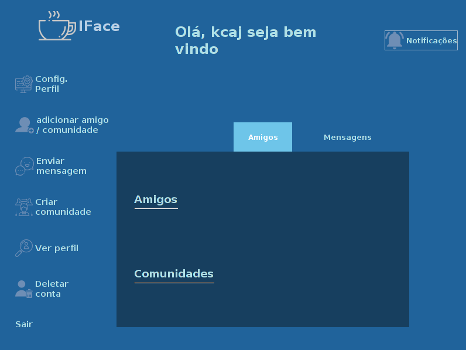
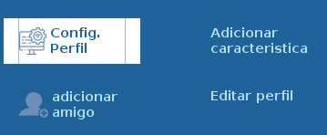
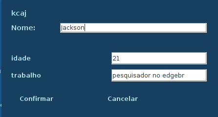
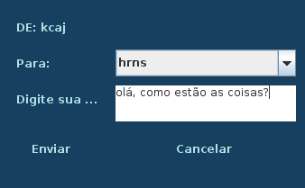

# iFace

## Funcionalidades
  
### Criar usuário
Ao iniciar o sistema será exibido para o usuário uma tela de login, nela existe um botão para a criação de um novo usuário, quando o usuário clicar nesse botão será apresentado a ele uma tela de cadastro para que sejam digitados o seu nome (posteriormente editável), seu nome de usuário e sua senha (estes fixos aquela conta), após todos os campos serem preenchidos e o botão "Confirmar" ser clicado um novo usuário é adicionado a base de dados (para este projeto salva numa lista). 
  
### Acessar um usuário
Após o login será apresentada ao usuário uma janela com as informações da sua conta - quem são seus amigos, de quais comunidades ele participa, além de um menu onde através dele o usuário pode editar suas informaçõs, adicionar novos dados, adicionar amigos, enviar mensagens, entre outras funcionalidades que vão ser explicadas abaixo, em outras palavras esta janela é a janela base de navegação no sistema.
  
Abaixo segue uma imagem com um exemplo desta tela

  
### Configurações de perfil
O primeiro botão do menu é o botão de configuração do perfil, ao clicar nele vão ser exibidos outros dois botões que são usudos para adicionar as informações ao seu perfil e para adicionar novas informações ao seu perfil, respectivamente, veja abaixo este "submenu".

#### Adicionar informações ao seu perfil
Para adicionar uma nova informação ao seu perfil basta clicar no botão **config. perfil** e depois clicar no botão **adicionar caracteristica**, feito isso você será redirecionado para uma janela pedindo o titulo da informação que você deseja adicionar (idade, status de relacionamento, formação, etc.), após isso, outra janela aparecerá solicitando que você digite a descrição da informação anteriormente citada, quando os dois forem digitados e confirmados pelo usuário será adicionado as suas informações.
#### Editar informações do perfil
Ao clicar no botão de edição de informações do perfil você será redirecionado a uma janela com seu nome de usuario  (_este, inalterável_), e com todas as suas outras informações - como nome (por padrão), idade, onde trabalha, entre outras coisas.
Para editar alguma informação, basta clicar na caixa de texto com o valor atual, alterar para o novo valor e clicar em confirmar e a informação será atualizada no seu perfil. Veja abaixo um exemplo de tela.

### Adicionar um amigo ou uma comunidade
Para adicionar um amigo ou ingressar em uma comunidade você vai clicar no botão **adicionar amigo/Comunidade** e digitar o nome do amigo ou da comunidade que você deseja adicionar ou ser inserido, feito isso, o sistema vai realizar uma busca e a partir disso cinco coisas podem acontecer
  - O usuário correspondente ser encontrado, com isso, uma notificação é enviada ao usuário.
  - Este usuário já ter enviado uma solitação de amizade para você, neste caso você será notificado disso eir nas notificações aceitar o usuário para ser adicionado.
  - Você já ser amigo do usuário.
  - Ser uma comunidade, neste caso, você é inserido como membro desta comunidade
  - Ser uma comunidade e você já estar inserido nela.
  - O nome buscado não ser encontrado.
  
### Enviar uma mensagem para um amigo ou uma comunidade
Ao selecionar esta opção no menu a esquerda será aberta uma janela com a sua lista de amigos e comunidades em uma caixa de seleção e um campo de texto para que você digite a mensagem que deseja enviar (Veja abaixo uma imagem desta tela).

### Criar comunidade 
### Acessar as informações de perfil de um usuário ou de uma comunidade
### Adicionar uma nova informação ao seu perfil (como idade, status de relacionamento, etc.)

icons color: #6E8EB5

Icons made by <a href="https://www.freepik.com/" title="Freepik">Freepik</a> from <a href="https://www.flaticon.com/" 			    title="Flaticon">www.flaticon.com</a> is licensed by <a href="http://creativecommons.org/licenses/by/3.0/" 			    title="Creative Commons BY 3.0" target="_blank">CC 3.0 BY</a>

