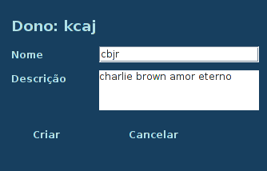
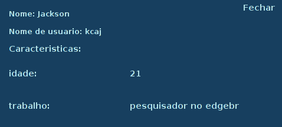
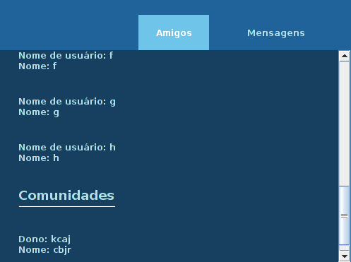
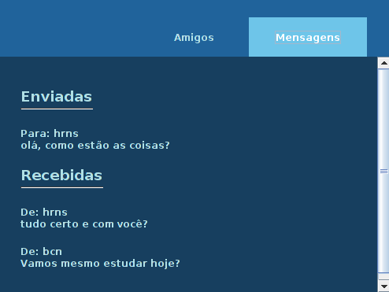

# iFace

## Funcionalidades
  
### Criar usuário
Ao iniciar o sistema será exibido para o usuário uma tela de login, nela existe um botão para a criação de um novo usuário, quando o usuário clicar nesse botão será apresentado a ele uma tela de cadastro para que sejam digitados o seu nome (posteriormente editável), seu nome de usuário e sua senha (estes fixos aquela conta), após todos os campos serem preenchidos e o botão "Confirmar" ser clicado um novo usuário é adicionado a base de dados (para este projeto salva numa lista). 
  
### Acessar um usuário
Após o login será apresentada ao usuário uma janela com as informações da sua conta - quem são seus amigos, de quais comunidades ele participa, além de um menu onde através dele o usuário pode editar suas informaçõs, adicionar novos dados, adicionar amigos, enviar mensagens, entre outras funcionalidades que vão ser explicadas abaixo, em outras palavras esta janela é a janela base de navegação no sistema.
  
Abaixo segue uma imagem com um exemplo desta tela

  
### Configurações de perfil
O primeiro botão do menu é o botão de configuração do perfil, ao clicar nele vão ser exibidos outros dois botões que são usudos para adicionar as informações ao seu perfil e para adicionar novas informações ao seu perfil, respectivamente, veja abaixo este "submenu".

#### Adicionar informações ao seu perfil

Para adicionar uma nova informação ao seu perfil basta clicar no botão **config. perfil** e depois clicar no botão **adicionar caracteristica**, feito isso você será redirecionado para uma janela pedindo o titulo da informação que você deseja adicionar (idade, status de relacionamento, formação, etc.), após isso, outra janela aparecerá solicitando que você digite a descrição da informação anteriormente citada, quando os dois forem digitados e confirmados pelo usuário será adicionado as suas informações.

#### Editar informações do perfil

Ao clicar no botão de edição de informações do perfil você será redirecionado a uma janela com seu nome de usuario  (_este, inalterável_), e com todas as suas outras informações - como nome (por padrão), idade, onde trabalha, entre outras coisas.
Para editar alguma informação, basta clicar na caixa de texto com o valor atual, alterar para o novo valor e clicar em confirmar e a informação será atualizada no seu perfil. Veja abaixo um exemplo de tela.

### Adicionar um amigo ou uma comunidade
Para adicionar um amigo ou ingressar em uma comunidade você vai clicar no botão **adicionar amigo/Comunidade** e digitar o nome do amigo ou da comunidade que você deseja adicionar ou ser inserido, feito isso, o sistema vai realizar uma busca e a partir disso cinco coisas podem acontecer
  - O usuário correspondente ser encontrado, com isso, uma notificação é enviada ao usuário.
  - Este usuário já ter enviado uma solitação de amizade para você, neste caso você será notificado disso eir nas notificações aceitar o usuário para ser adicionado.
  - Você já ser amigo do usuário.
  - Ser uma comunidade, neste caso, você é inserido como membro desta comunidade
  - Ser uma comunidade e você já estar inserido nela.
  - O nome buscado não ser encontrado.
  
### Enviar uma mensagem para um amigo ou uma comunidade

Ao selecionar esta opção no menu a esquerda será aberta uma janela com a sua lista de amigos e comunidades em uma caixa de seleção e um campo de texto para que você digite a mensagem que deseja enviar (Veja abaixo uma imagem desta tela).

### Criar comunidade 

Para criar uma comunidade você deve clicar no botão **criar comunidade**, feito isso uma janela vai abrir e solicitar o nome da comunidade e uma breve descrição desta.

### Acessar as informações de perfil de um usuário ou de uma comunidade

Ao clicar no botão **ver perfil** será aberta uma janela que vai solicitar o nome de usuário ou o nome da comunidade, após este ser digitado e confirmado pelo usuário, o iFace faz uma busca em sua base de dados e, em caso de encontrar uma correspondencia (vale lembrar que o nome de usuário e o nome da comunidade é único e inalterável) ele exibirá uma janela com essas informações, veja abaixo um exemplo:

### ver seus amigos, suas comunidades ou suas mensagens

No centro inferior da janela inicial é exibido um painel sob dois botões, são eles: amigos e mensagens.

Ao clicar em **amigos** o painel é atualizado e nele é carregado o nome de usuário e o nome de todos os seus amigos, assim, como, todas as comunidades.

Ao clicar em **mensagens** o painel é atualizado e nele são exibidas todas as suas mensagens enviadas e recebidas (inclusive as mensagens que você recebeu através das comunidades que participa).

### Notificações de amizade

No canto superior direito há um botão relativo as notificações, sempre que houver notificações de amizade o sino tem uma imagem indicando que ele está tocando, quando não houver notificações não respondidas, um sino parado.

### Deletar conta

Por fim, a função de deletar sua conta, ao fazer isso tudo relacionado a você, para fazer isso, é percorrida sua lista de amigos e exclui você da lista de amigos deles, feito isso, algo similar acontece nas notificações, mas é removido da lista de notificações, depois disso, são buscadas as comunidades que você participa e é dono se só existir você ela é apagada, caso contrario é passada a posse dela para algum outro membro, em seguida são apagas as mensagens enviadas por você e para você, e, por fim, sua conta é removida do banco de dados do sistema.

## Classes

### Community
  - Motivação: Definir o que é uma comunidade para o sistema
  - Solução: Com isso é possivel ter dados compartilhados globalmente com todos os usuário através de uma lista de comunidades
  - Vantagem: Com ela é possível agrupar todas as informações de uma comunidade 

### Message
  - Motivação: Definir o que seria a messagem no sistema
  - Solução: agrupar em um mesmo objeto quem enviou, o que enviou e para quem enviou
  - Vantagem: Ter todos os dados agrupados em um só objeto, permitindo assim que apenas os os usuários relacionados a mensagem tenham acesso a ela
  - Desvantagem: Informação duplicada, pois, a mesma mensagem é salva no usuário que enviou e no usuário que recebeu a mensagem.

### User
  - Motivação: Agrupar todas as informações que cabem no usuário em relação as especificações sistema
  - Solução: criar um usuário e dar a ele acesso as suas informações
  - Vantagem: Poder ter uma lista de usuários global compartilhada para todos os usuários.
  - Desvantagem: Informação duplicada, para formar a lista de amigos e de notificações de amizade é salvo todo o objeto do outro usuário em duas novas listas além da lista global.

### JButtonUTILS
  - Motivação: Criar uma classe que tenha os padrões de configuração de botões 
  - Solução: Eliminar a duplicação de trechos de código para configurar um botão
  - Vantagem: eliminar a duplicação de código

### Pair 
  - Motivação: Criar um objeto que possa agrupar informações em pares para salvar os novos detalhes de cada usuário (tendo na chave e valor o titulo e a descrição da caracteristica)
  - Solução: Criar um objeto que agrupe informações em pares 
  - Vantagem: Quando a relação direta entre os objetos (como no caso de titulo e descrição) é interessante que os dois sejam salvos juntos, para evitar a chance de ter um chaveamento errado e relacionar o que deveria ser uma chave com o valor errado

### UTILS
  - Motivação: Ter agrupado os dados gerais do sistema, como o URL base das imagens, as cores utilizadas no fundo e nas fontes, além da estilização do texto.
  - Solução: Uma classe com constantes que tenham esses valores estaticos.
  - Vantagem: Se for necessário alterar a paleta de cores ou o caminho onde as imagens estão, basta alterar a sua constante e será atualizado para todo o sistema.

### ViewAPI 
  - Motivação: Evitar a duplicação de código na configuração do sistema 
  - Solução: Criar uma classe que faça essas configurações de maneira geral e, ao passar os componentes que ela
  - Vantagem: redução na duplicação e na quantidade de código escrito, visto que em seus métodos são recebidos arrays e, por conta disso, é possivel percorrer os componentes com um for e aplicar a eles certa configuração

### Account
  - Motivação: Ter uma janela que agrupe as funcionalidades do usuário
  - Solução: Criar uma classe que crie as funcionalidades
  - Vantagem: Ter em um só lugar toda a navegação do usuário pós login

### addCommunity
  - Motivação: Ter uma janela que faça o cadastro de uma nova comunidade
  - Solução: Criar uma janela com os dados de uma nova comunidade
  - Vantagem: Ter uma forma interativa de adicionar uma nova comunidade

### DetailUser
  - Motivação: exibir de os detalhes do usuário de forma interativa e amigavel
  - Solução: Criar uma janela que exiba de forma amigavel as informações do usuário
  - Vantagem: É mais atrativo para o usuário ter os dados exibidos em uma janela do que no terminal 
### EditProfile
  
icons color: #6E8EB5

Icons made by <a href="https://www.freepik.com/" title="Freepik">Freepik</a> from <a href="https://www.flaticon.com/" 			    title="Flaticon">www.flaticon.com</a> is licensed by <a href="http://creativecommons.org/licenses/by/3.0/" 			    title="Creative Commons BY 3.0" target="_blank">CC 3.0 BY</a>

